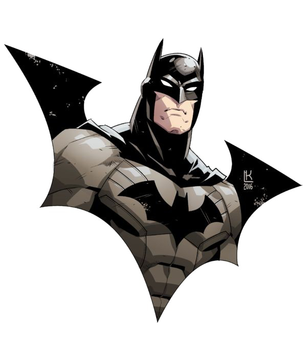

    
# ✨ Larissa Inês Calisto: Desenvolvedora Back-end Criativa ✨

 
    

  

    
    

## ⭐ Sobre Mim

✨Sou desenvolvedora backend e estudante de ciências da computação, sou completamente fascinada por computadores, tanto o hardware quanto o software, e qualquer tipo de tecnologia minimamente inovadora ou criativa.✨
Sou uma pessoa criativa, curiosa e inquieta, então sempre busco novos hobbies porque amo aprender coisas novas, e por achar muito divertido!!!✨✨✨

✨Durante minha jornada como desenvolvedora, fui colecionando aprendizados incríveis e explorando ideias que se transformaram em projetos com impacto positivo na sociedade.✨
Com o tempo, me tornei uma profissional dedicada, curiosa e apaixonada por resolver problemas reais — sempre buscando criar soluções que façam a diferença de verdade. 💻

    

💫 HTML5 • CSS3 • JavaScript • React 💫

⚡ Python • C# • .NET ⚡

💫 SQL Server • MySQL 💫

⚡ Git • GitHub • VS Code • Figma ⚡

 
 

  

    

<h2> ⭐ My Contributions:</h2>

<picture>
  <source media="(prefers-color-scheme: dark)" srcset="https://raw.githubusercontent.com/JaiDev-bot/JaiDev-bot/output/pacman-contribution-graph-dark.svg">
  <source media="(prefers-color-scheme: light)" srcset="https://raw.githubusercontent.com/JaiDev-bot/JaiDev-bot/output/pacman-contribution-graph.svg">
  
</picture>

    <h3>🌎 Onde me encontrar</h3>
    
Interessado em ver como transformo ideias em código? Explore meus projetos ou entre em contato:

    <a href="https://www.linkedin.com/in/larissa-in%C3%AAs-calisto-1468263a7=/">Linkedin</a>✨

    

    
    

